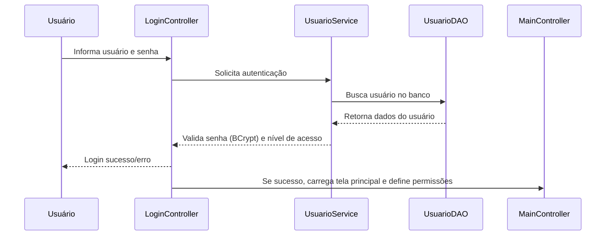

# Documentação do Projeto RFVendas

## 1. Visão Geral

O RFVendas é uma aplicação desktop para gerenciamento de vendas, desenvolvida em JavaFX, com persistência em MySQL. O sistema é modularizado e segue a arquitetura MVC (Model-View-Controller), facilitando manutenção, extensibilidade e organização do código.

---

## 2. Arquitetura e Estrutura de Diretórios

```mermaid
graph TD
    Main[Main (JavaFX Application)]
    LoginController[LoginController]
    MainController[MainController]
    OutrosControllers[Outros Controllers]
    FXML[Arquivos FXML]
    CSS[styles.css]
    Imagens[icon.png, icon.ico]
    Service[Services]
    DAO[DAOs]
    Entity[Entities]
    Util[Utils]
    MySQL[(MySQL Database)]

    Main -->|start()| LoginController
    LoginController -->|Login bem-sucedido| MainController
    MainController --> OutrosControllers
    MainController --> Service
    OutrosControllers --> Service
    Service --> DAO
    DAO --> MySQL
    FXML --> Main
    CSS --> Main
    Imagens --> Main
    Util --> Main
    Entity --> DAO
    Entity --> Service
```

**Diretórios principais:**
- `src/main/java/BackEnd/`: código-fonte principal.
  - `controller/`: controllers das telas (um para cada FXML).
  - `model/entity/`: entidades de domínio.
  - `model/dao/interfaces/` e `model/dao/impl/`: interfaces e implementações DAO.
  - `model/service/`: lógica de negócio.
  - `util/`: utilitários (conexão, validação, sessão, etc).
- `src/main/resources/`: recursos da aplicação.
  - `fxml/`: arquivos de interface.
  - `styles/`: estilos CSS.
  - `images/`: ícones.

---

## 3. Fluxo Principal da Aplicação

- **Inicialização:** Ao iniciar, carrega `Login.fxml` e aplica o tema de `styles.css`.
- **Login:** Usuário informa credenciais. O `LoginController` valida usando o serviço de autenticação e consulta o banco via DAO.
- **Permissões:** Após login, o sistema identifica o nível de acesso do usuário (ex: administrador, operador) e ajusta as permissões de acordo.
- **Tela Principal:** Após autenticação, importa backup do banco (se necessário) e carrega `Main.fxml`.
- **Navegação:** O usuário acessa funcionalidades (cadastro, listagem, pedidos, etc.) via controllers específicos, que interagem com services e DAOs.

### Fluxo de Autenticação e Permissões



- O sistema utiliza BCrypt para hash de senha.
- O nível de acesso é definido pela entidade `NivelAcesso` e controla o acesso a funcionalidades.

---

## 4. Principais Entidades e Exemplos de Uso

### Cliente

```java
Cliente cliente = new Cliente("João Silva", "joao@email.com", "123.456.789-00");
clienteService.cadastrarCliente(cliente);
```

### Pedido

```java
Pedido pedido = new Pedido(cliente, LocalDate.now(), StatusPedido.ABERTO);
pedidoService.registrarPedido(pedido);
```

### Item

```java
Item item = new Item("Caneta", "Material Escolar", 2.50, 100);
itemService.cadastrarItem(item);
```

- As entidades são persistidas via DAOs e manipuladas via services.
- O relacionamento entre entidades (ex: Pedido e ItemPedido) é gerenciado nas camadas de serviço e DAO.

---

## 5. Customização Visual

- **Alteração de Tema:** Edite `src/main/resources/styles/styles.css` para modificar cores, fontes e layout.
- **Ícones:** Substitua ou adicione arquivos em `src/main/resources/images/` (ex: `icon.png`, `icon.ico`) para personalizar ícones da aplicação.
- **FXML:** As telas podem ser customizadas editando os arquivos em `src/main/resources/fxml/`.

---

## 6. Dependências

- JavaFX (controls, fxml, graphics, base)
- MySQL Connector/J
- BCrypt (org.mindrot.jbcrypt)
- JUnit (testes)

---

## 7. Build e Execução

- **Pré-requisitos:** Java 17+, Maven.
- **Build:** 
  ```
  mvn clean package
  ```
- **Execução:** 
  ```
  mvn javafx:run
  ```
  ou
  ```
  java -jar target/RFVendas-1.0-SNAPSHOT.jar
  ```

---

## 8. Observações

- Modularização via `module-info.java`.
- Estrutura extensível para novas telas e entidades.
- Backup do banco importado ao abrir a tela principal.
- Testes automatizados com JUnit.